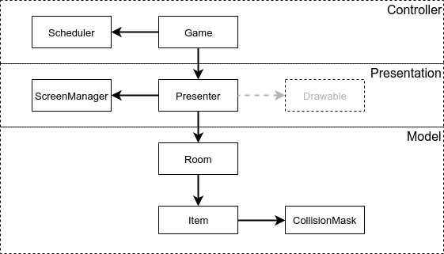

# pv260_tron_game
PV260 - 2. assignment

usage:

build in BOTH game and engine subdirectory
```
mvn clean install 
```

run in game subdirectory
```
mvn exec:java
```

We divided structure into 2 maven modules, `game` and `engine`. engine is supposed to be reusable for more games, `game` contains desired Tron game.

Each module is divided into 3 java packaged, `controller`, `presentation`, `model`. Together they forms layer architecture. Where each layer depends only on layer below. 



`Controllers` base class is `Game`
 * `Game`s responsibility is to start game loop and each step notify `Presenter`
 * * it depends on `Scheduler` and `Presenter`
 * `Scheduler` is responsible for timeing game loop    

`Presentation` base class is `Presenter`
 * `Presenter`s responsibility is draw `Room`, its `Item`s and handling Key and mouse Events and propagating them to `Room` (this could be further divided into another class such as `Drawable` > ImageDrawable, ShapeDrawable, AnimationDrawable)
 * * it depends on `Room` and `ScreenManager`
 * `ScreenManager` is responsible for correctly initialization of dispplay window
 
`Model` base class is `Room`. It represents one level of a game
 * `Room`s responsibility is to manage all containing `Item`s
 * * it depends on `Item`
 * `Item` represents one item in room (such as player, ball, tree, ...)
 * * it is responsible for moving (it has its position within the `Room`) itself and reacting on outside events (key pressed, collision)
 * * it depends on `CollisionMask`
 * `CollisionMask` represents solid interactive shape of `Item`. All collisions is handeled in repsect to this.
 
 
